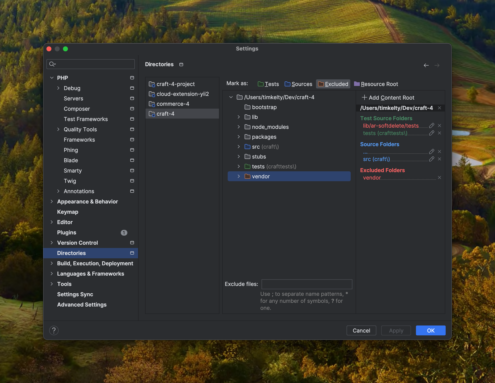
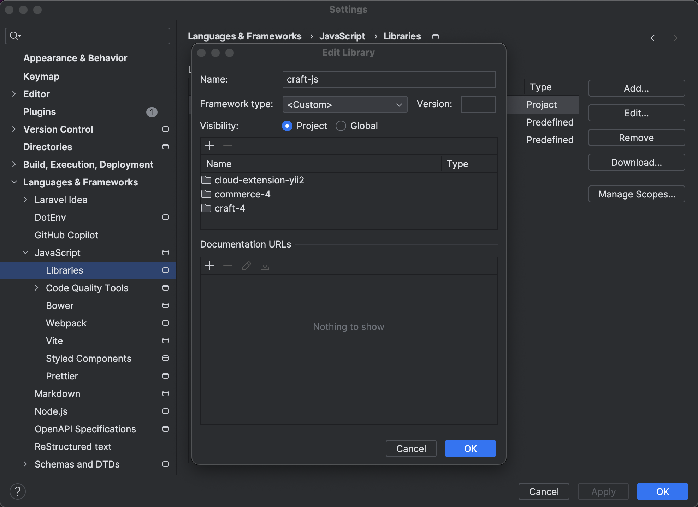

# craft-dev

A DDEV-based development environment for Craft CMS.

## Requirements

- DDEV
- Orbstack (not technically required, but as we will be make use of bind-mounts, it is highly recommended)

## Setup

### Disable Mutagen

When using Orbstack, you likely don't want to be using Mutagen, which is enabled by default. To disabled for existing and future projects:

```shell
ddev mutagen reset && ddev config global --performance-mode=none && ddev config --performance-mode=none
```

### Clone packages

Clone the packages you want to work on into a canonical location, e.g.:

```shell
git clone --branch v3 git@github.com:craftcms/cms.git ~/Dev/craftcms-3
git clone --branch develop git@github.com:craftcms/cms.git ~/Dev/craftcms-4
git clone --branch 5.0 git@github.com:craftcms/cms.git ~/Dev/craftcms-5
git clone --branch develop git@github.com:craftcms/commerce.git ~/Dev/commerce-4
``` 

### Create projects

Clone this project, create a new one, or use an existing one.
If cloning this project, there are branches for each major version of Craft:

```shell
git clone --branch 3.x git@github.com:timkelty/craft-dev.git ~/Dev/craft-3-project
git clone --branch 4.x git@github.com:timkelty/craft-dev.git ~/Dev/craft-4-project
git clone --branch 5.x git@github.com:timkelty/craft-dev.git ~/Dev/craft-5-project
```

### Composer

Within your project, run:

```shell
composer config repositories.local --json '{
  "type": "path",
  "url": "/tmp/packages/*",
  "options": {
    "symlink": true
  }
}'
```

### DDEV

With your project running (`ddev start`), run:

```shell
ddev describe -j | jq --raw-output .raw.services.db.host_ports
```

Copy the returned integer.

#### .ddev/config.local.yaml

```shell
cp .ddev/config.local.yaml.example .ddev/config.local.yaml
```

Paste the value from above as the value of `host_db_port`.
This will lock this project to that port, so you can save it in TablePlus or wherever.

#### .ddev/docker-compose.local.yaml

```shell
cp .ddev/config.local.yaml.example .ddev/config.local.yaml
```
Modify the `volumes` list to include any paths to checked out repos you'd like to work on.

  - On the left side of the `:` is the path on your host machine. Change this to the path of your checked out package repos.
  - On the right side of the `:` is the path within the container. This can be anything, so long as it resides in `/tmp/packages/*`.

## PhpStorm Settings

### Attach Projects

For each package repo you want to work on, attach it via `File -> Attach project…`.

- Funny things happen if you attached project have `.`s in them.
- If `Attach Project…` isn't appearing, try the normal `Open…` dialog. It should ask you if you want to attach it. 


It should end up looking something like this:


### `PHP -> Composer`

- uncheck `Add packages as libraries`


### `PHP -> Debug`

- remove `9000` from `Xdebug -> Debug port` (optional)
  - 9000 is no longer the default port for Xdebug and often conflicts with other services.
- uncheck `Force break at first line when no path mapping specified` (optional)
- uncheck `Force break at first line when a script is outside the project` (optional)


### `PHP -> Servers -> Path Mappings`

- For your _additional_ project roots (i.e. composer packages):
  - Absolute path on the server: `/tmp/packages/<package-name>`, e.g. `/tmp/packages/craft-4`


### `PHP -> Directories`

- Ensure `vendor` is marked as `Excluded` for each of your _additional_ project roots (i.e. composer packages).



### `Languages & Frameworks -> JavaScript -> Libraries`

- Add an entry and include the root of each of your _additional_ project roots (i.e. composer packages).



### `PHP -> Include Path`

- Ensure this is **empty**. If not, remove all entries.


